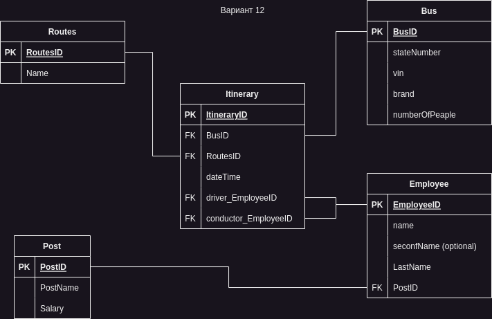

# Course Project site for Database `Passenger Automobile Enterprise`
## Terms of Reference
### Source data:
1. Buses
2. Routes
3. Itinerary sheets
4. Personnel credentials (positions, categories, etc.)
5. Personnel (full name, D.R., etc.)
6. Remuneration
### Assumptions:
1. The work of the automobile enterprise is provided by the personnel of the enterprise, which can be divided by categories of positions into administration, engineering and technical personnel and personnel servicing routes (drivers, conductors).
2. When going on a route, the bus driver receives an itinerary (or waybill) containing information about the bus, route, operating mode, driver, conductor.
### Requests:
1. On a certain date, for all route numbers, show information about the number of buses serving the route
2. For each route number and date, show information about the buses serving the route (tail number, make, state number)
3. According to the results of the work for the month, count the number of flights performed by each bus or on each route.
4. Based on the results of the work for the half-year, calculate the number of shifts worked by each driver and conductor.


# Курсовой проект по базам данных `Пассажирское автопредприятие`
## ТЗ
### Исходные данные:
1. Автобусы
2. Маршруты
3. Маршрутные листы
4. Учетные данные персонала (должности, категории и тд)
5. Персонал (ФИО, д.р. и тд)
6. Оплата труда
### Допущения: 
1. Работу автопредприятия обеспечивает персонал предприятия, который можно разделить по категориям занимаемых должностей на администрацию, инженерно-технический персонал и персонал, обслуживающий маршруты (водители, кондукторы).
2. Выезжая на маршрут, водитель автобуса получает маршрутный лист (или путевой лист), содержащий данные об автобусе, маршруте, режиме работы, водителе, кондукторе.
### Запросы: 
1. На определенную дату для всех номеров маршрутов показать информацию о количестве автобусов,  обслуживающих маршрут
2. По каждому номеру маршрута и дате показать информацию об автобусах, обслуживающих маршрут (бортовой номер, марка, гос.номер)
3. По итогам работы за месяц посчитать количество рейсов, выполненных каждым автобусом или на каждом маршруте.
4. По итогам работы за полугодие посчитать количество смен, отработанных каждым водителем и кондуктором.

## Cхема базы данных 


## SQL
```
CREATE TABLE JobTitle (
    JobTitleID serial PRIMARY KEY,
    PostName varchar(255) NOT NULL,
    Salary double precision
);
CREATE TABLE Department (
    DepartmentID serial PRIMARY KEY,
    Name varchar(255) NOT NULL
);
CREATE TABLE DriverCategory (
    DriverCategoryID serial PRIMARY KEY,
    Category varchar(255) NOT NULL
);
CREATE TABLE Employee (
    EmployeeID serial PRIMARY KEY,
    Name varchar(255) NOT NULL,
    SecondName varchar(255),
    LastName varchar(255) NOT NULL,
    JobTitleID integer REFERENCES JobTitle(JobTitleID),
    DriverCategoryID integer REFERENCES DriverCategory(DriverCategoryID),
    DepartmentID integer REFERENCES Department(DepartmentID)
);
CREATE TABLE Routes (
    RoutesID serial PRIMARY KEY,
    Number varchar(255) NOT NULL,
    "From" varchar(255) NOT NULL,
    "To" varchar(255) NOT NULL,
    DepartureTime varchar(255),
    ArrivalTime varchar(255)
);
CREATE TABLE Brand (
    BrandID serial PRIMARY KEY,
     varchar(255) NOT NULL
);
CREATE TABLE Bus (
    BusID serial PRIMARY KEY,
    StateNumber varchar(255) NOT NULL,
    VIN varchar(255) NOT NULL,
    BrandID integer REFERENCES Brand(BrandID),
    NumberOfPeople integer
);
CREATE TABLE Itineraty (
    ItineratyID serial PRIMARY KEY,
    BusID integer REFERENCES Bus(BusID),
    RoutesID integer REFERENCES Routes(RoutesID),
    DateTime varchar(255) NOT NULL,
    Driver_EmployeeID integer REFERENCES Employee(EmployeeID),
    Conductor_EmployeeID integer REFERENCES Employee(EmployeeID)
);
```
## Страницы фронтенда
1. [ ] Оснавная с выбором действия
   1. [ ] Изменение данных 
      1. [X] Изменение списка JobTitle
      2. [X] Изменение списка Department
      3. [x] Изменение списка DriverCategory
      4. [x] Изменение списка сотрудников (добавление сотрудника выбор сотрудника, )
      5. [x] Изменение списка маршрутов
      6. [x] Изменение списка марки автобусов
      7. [x] Изменение списка автобусов
   2. [ ] Состовление маршрутов
      1. [ ] Выбор сотрудника, выбор водителя, выбор автобуса, выбор маршрута, выбор даты и времени и количества roundtrip.
   3. [ ] Запросы
      1. [ ] По дате найти все маршруты и количество автобусов на нём
      2. [ ] По дате и номеру маршрута вся информация об автобусах
      3. [ ] За месяц подсчитать количество рейсов на маршруте или автобусом
      4. [ ] За полгода расчитать количество смен кондукторами и водителями
   
## Стрек используемых технологий
1. Flask
2. psycopg2